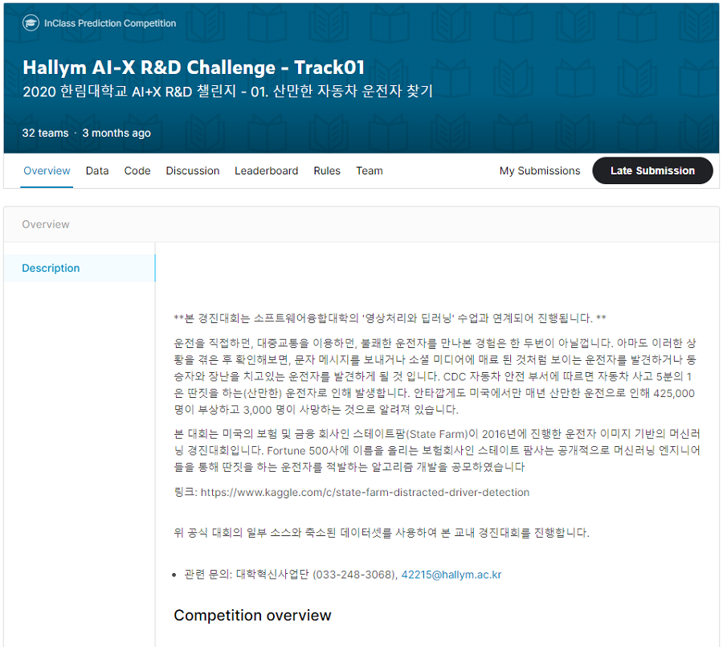
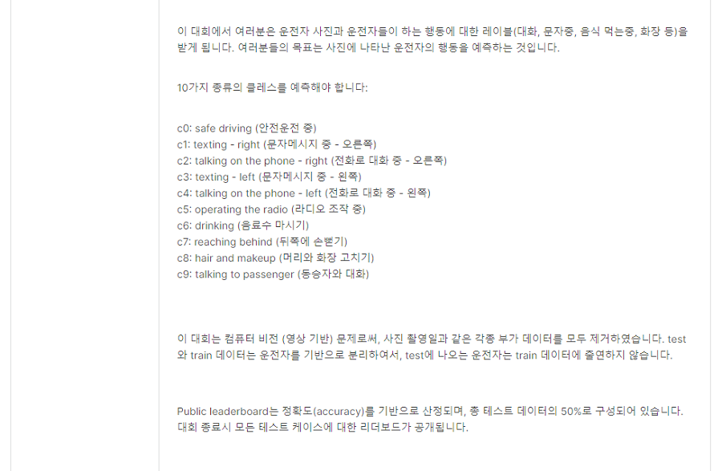
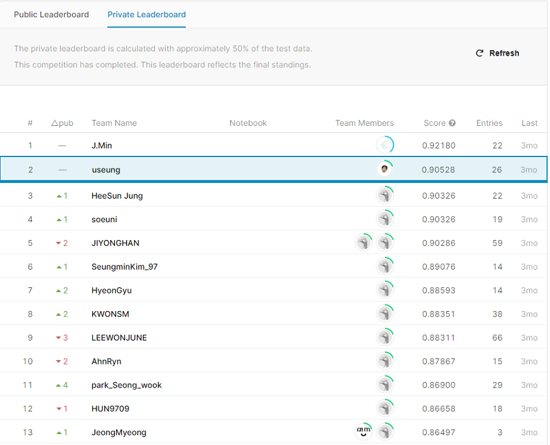
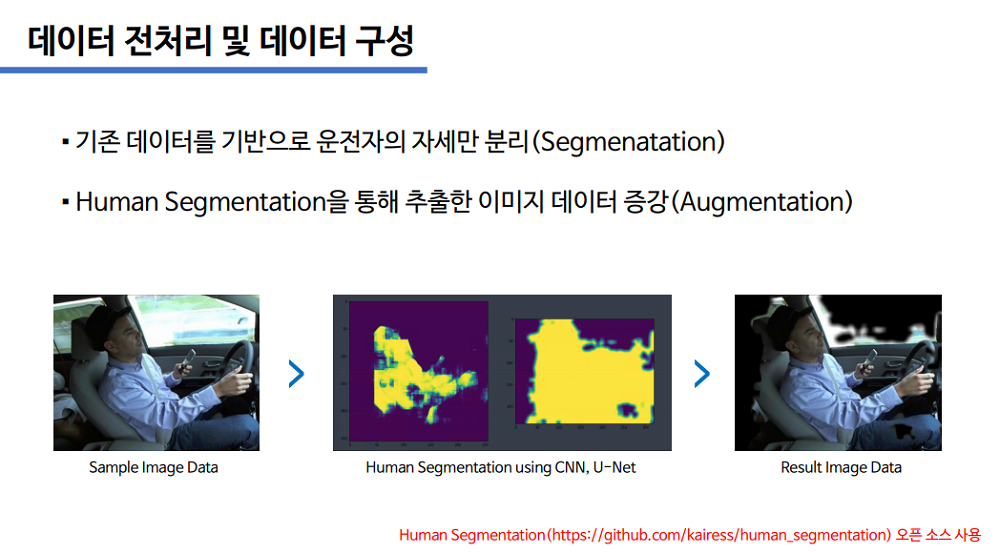
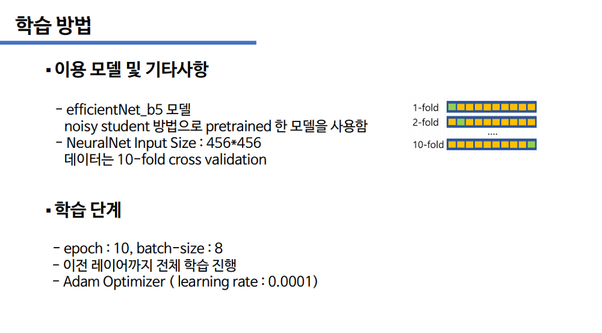
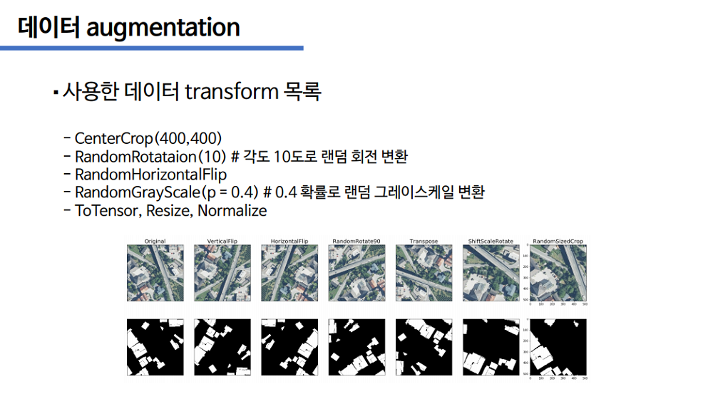

# Hallym_AI-X_RnD_Challenge
## Track01. 산만한 자동차 운전자 찾기 (2020 한림대학교 AI+X R&amp;D 챌린지)

[\[Competition Page\]](https://www.kaggle.com/c/hallym-2020-2-aicomp01) 

## Private Leaderboard : 2nd (Name : useung)

[\[Solution 참고\]](./solution_track01_report.pdf) 

### sub_log
99.83 - tf_efficientNet_b5_ns  lr - 0.0001 ep 10

*************************************************************************************************************************
99.83 - tf_efficientNet_b5_ns / lr - 0.0001 / ep 10   
transforms(resize(456,456), CenterCrop(400,400), RandomHorizontalFlip, RandomGrayscale(p=0.4), RandomRotation(10)  
param.require_grad = True(이전 레이어 전체 학습)  
data loader : train - batchsize 8 , val - batchsize 4  

Dataset - image preprocessing
 기존 데이터에서 운전자의 자세만 분리하기 위한 Image Segmentation
 (Human Segmentation을 통해 특징점에 더 집중할 수 있도록 데이터 증강)
 Data Augmentation - OpenCV, U-Net 활용 ([\[Human Segmentation\]](https://github.com/kairess/human_segmentation) 오픈 소스 사용) 
 
 

Albumentation
 

Best acc : 0.9980 
Evaluation 
Avg loss(test) : 0.0027 
Avg acc(test) : 0.9980 

*************************************************************************************************************************
 

Public Leaderboard Score : 0.91532 
Private Leaderboard Score : 0.90528